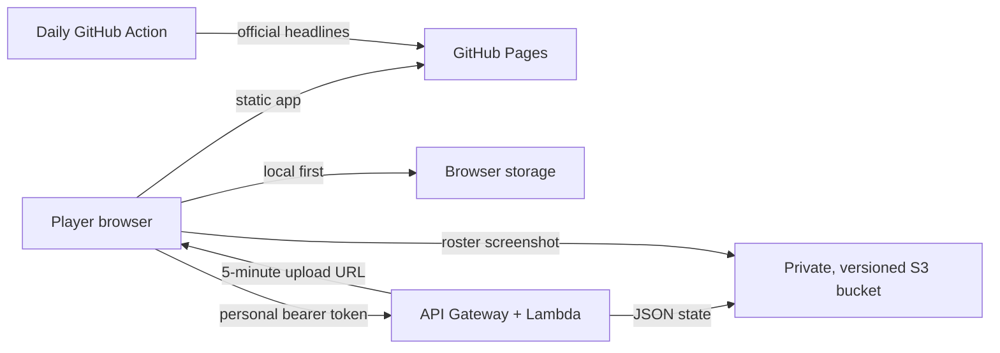

# The Maester's Ledger

A dark, responsive companion for **Game of Thrones: Legends**. It tracks an unlocked champion roster, reads progression from screenshots, saves five-champion formations, and gathers official news and upcoming events.

This is an unofficial fan project. Game of Thrones, Game of Thrones: Legends, and related names are property of their respective owners. The app ships no game artwork or proprietary assets.

## What is included

- Local-first champion ledger with level, stars, power, shards, role, faction, rarity, gem color, and favorites
- In-browser screenshot OCR with an explicit review step before any roster update
- Five-slot team builder with leader selection, battle modes, power totals, color coverage, and faction signals
- Official news feed and an event calendar seeded from the August 2026 official calendar
- Daily GitHub Action that refreshes official news headlines
- Private S3 storage through a small AWS SAM API; no AWS keys are exposed to the browser
- GitHub Pages deployment on every push to `main`

## Run locally

Requirements: Node.js 22+ and npm.

```bash
npm install
npm run dev
```

Quality checks:

```bash
npm test
npm run lint
npm run build
```

The app always saves to browser local storage. Cloud sync is optional during local development.

## Architecture



The personal token protects a single-user installation. The Lambda validates it and alone has S3 permissions. Roster images use five-minute presigned PUT URLs. The bucket blocks all public access and keeps object versions.

## Deploy the private S3 sync service

Requirements: an AWS account, the AWS CLI, and AWS SAM CLI configured for the account.

1. Choose a long random token. A password manager-generated value of 32+ characters is appropriate.
2. From the infrastructure directory, build and deploy:

   ```bash
   cd infrastructure
   sam build
   sam deploy --guided
   ```

3. For `SyncToken`, enter the token from step 1.
4. For `AllowedOrigin`, enter the Pages origin only, such as `https://corypahl.github.io`. Do not include `/got-rpg`.
5. Keep the remaining guided defaults and allow SAM to create IAM roles.
6. Copy the `SyncApiUrl` stack output.
7. Open the companion's **Settings** page, paste the API URL and personal token, save, and choose **Back up now**.

The token is stored in that browser's local storage. It is never compiled into the Pages bundle. Do not use an AWS access key as the token.

To remove the AWS stack later:

```bash
sam delete
```

Because the bucket is versioned and contains data, AWS may require its objects and versions to be removed before stack deletion.

## Publish with GitHub Pages

1. Push `main` to GitHub.
2. In the repository, open **Settings → Pages**.
3. Set **Source** to **GitHub Actions**.
4. The `Deploy companion to GitHub Pages` workflow will test, build, and publish `dist/`.

Hash-based routing and a relative Vite asset base make the same build work at `/got-rpg/` and at custom domains without a 404 fallback.

## Screenshot importing

The OCR worker runs entirely in the browser and is downloaded only when the scanner opens. Best results come from the game's Champions roster view:

- Crop away top resource bars and bottom navigation.
- Keep champion names and progression numbers visible.
- Import several screenshots when the roster scrolls beyond one screen.
- Review names, levels, and power before accepting the scan.

OCR intentionally matches against the catalog in [`src/data/catalog.ts`](src/data/catalog.ts). Add newly released champions there to improve recognition. An unknown champion can always be entered manually.

## News maintenance

[`scripts/update-news.mjs`](scripts/update-news.mjs) reads headline links and dates from the official news page. The scheduled workflow updates only the headline feed; event dates remain curated in [`public/data/news.json`](public/data/news.json) so that ambiguous natural-language times are never silently guessed.
