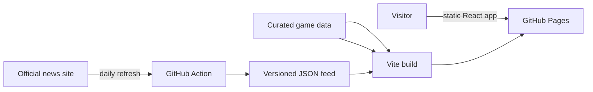

# The Maester's Index

A dark, responsive strategy companion for **Game of Thrones: Legends**. The site turns the original personal roster tracker into a public field guide: a complete searchable champion index, sourced and curated team blueprints, Crown Challenge routes, raid and Legendary Assault counters, official event coverage, and a release radar.

[Open the live site](https://corypahl.github.io/got-rpg/)

This is an unofficial fan project. Game of Thrones, Game of Thrones: Legends, and related names are property of their respective owners. The project ships no game artwork or proprietary assets.

## Included

- Searchable champion index with variant, rarity, gem color, faction, role, mechanic, and strategy-tier filters
- Champion detail views that connect each character to indexed teams and active or upcoming events
- Mode-specific team library for meta play, Crown Challenge, Raid Offense, Raid Defense, and Legendary Assault
- Evidence labels that distinguish official five-unit lineups, official-tested cores, community meta, and mechanic-based recommendations
- Weekly Crown Challenge faction schedule and four legal starter formations
- Release radar for announced, teased, and newly released champions
- Official news and a curated event calendar with featured champion links
- Automated GitHub Pages deployment and a daily official-news refresh

## Run locally

Requirements: Node.js 22+ and npm.

```bash
npm install
npm run dev
```

Quality checks:

```bash
npm test
npm run lint
npm run build
```

## Architecture

The application is intentionally static. It has no account system, personal roster state, upload flow, or cloud-storage backend.



Hash routing and a relative Vite asset base make the same production build work under `/got-rpg/` and on a custom domain.

## Data and evidence

The champion index is maintained in [`src/data/gameData.ts`](src/data/gameData.ts). The initial roster baseline comes from the community-maintained Game of Thrones: Legends Wiki and is supplemented by official champion announcements. Unverified entries are explicitly identified as community-indexed in the UI.

Team recommendations always include an evidence level and source. “Official lineup” means the game team published all five positions together. “Official-tested core” means official design notes named key champions. Community and mechanic-based formations are useful starting points, not claims of official win-rate data.

Event dates live in [`public/data/news.json`](public/data/news.json) so ambiguous natural-language schedules are never guessed at runtime. [`scripts/update-news.mjs`](scripts/update-news.mjs) refreshes only official headlines.

## Publish

Push `main`. The `Deploy Maester's Index to GitHub Pages` workflow tests, builds, and publishes `dist/`. The `Refresh official news` workflow checks the official news feed each day and commits a change only when headlines move.
